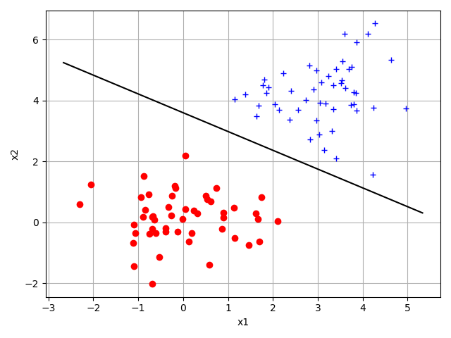
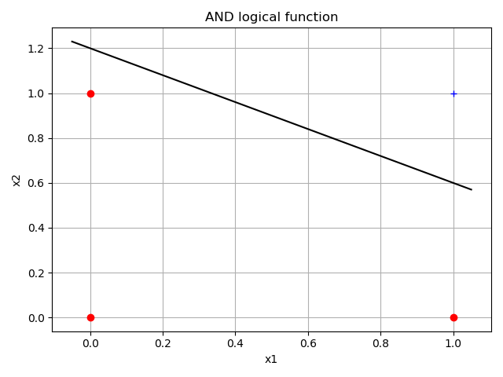
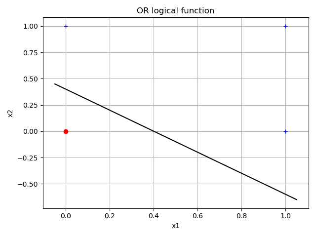

# T04 Perceptron linear
Due Date: Oct 25, 2019

## Desenvolver o código em Python (NumPy) que executa o perceptron linear (porta de limiar) que separa adequadamente a distribuição de dados feita na semana anterior (T03)
- Ver código python: separate_random_data.py
- Ver resultado gráfico: separate_random_data.png (figura abaixo)

## Implementar o código de um modelo que executa as funções lógicas AND e OR
- Ver código python: separate_and_or.py
- Ver resultados gráficos: separate_and.png e separate_or.png (figuras abaixo)

## Implementar o código de um modelo que executa a função lógica XOR
- Ver código python: separate_xor.py
- Ver resultado gráfico: separate_xor.png(figura abaixo)

